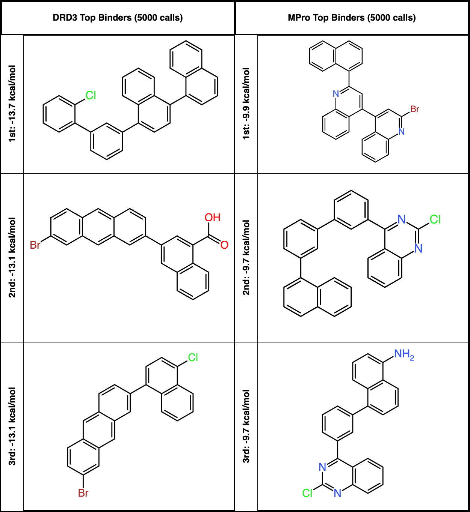

# SynthesisNet

This repo contains the code and analysis scripts for Procedural Synthesis of Synthesizable Molecules. [[Preprint](https://arxiv.org/abs/2409.05873), [Poster](https://iclr.cc/virtual/2025/poster/29833)]

### Introduction
Our model serves both
Synthesizable Analog Generation and Synthesizable Molecular Design applications. Our method is benchmarked against baselines from [PMO](https://proceedings.neurips.cc/paper_files/paper/2022/hash/8644353f7d307baaf29bc1e56fe8e0ec-Abstract-Datasets_and_Benchmarks.html) and evaluated against a wide range of objectives relevant to drug discovery:
- VINA Docking Simulations on MPro, DRD3 (more in Case Study section) \[[Results](./data/assets/results/Docking.csv)\]
- Bioactivity Oracles (GSK3B, JNK3, DRD2) \[[Results](./data/assets/results/Results%20(pt%201).csv)\]
- Structure-based Oracles (Median1, Median2, Celecoxib Rediscovery) \[[Results](./data/assets/results/Results%20(pt%202).csv)\]
- Multi-property Optimization for Real Drugs (Osimertinib, Fexofenadine, Ranolazine, Perindopril, Amlodipine, Sitagliptin, Zaleplon) \[[Results](./data/assets/results/Results%20(pt%203).csv)\]


Our method ranks near the top across all Oracles ([Visualization](./data/assets/figs/rankings/Top_1.png)). The superior synthetic accessibility scores ([Visualization](./data/assets/figs/rankings/Top_1_SA.png)) and sample-efficiency ([Visualization](./data/assets/figs/rankings/Top_1_AUC.png)) of our method shows promise for accelerating real-world synthetic drug discovery. 
(Note: If the asset doesn't show up in the links above, try refreshing the page.)


### Overview


Our innovation is to model synthetic pathways as *programs*. This section overviews the
basic concepts for understanding the core ideas of our work. Terminologies from program
synthesis are italicized. In computers, programs are first parsed into a tree-like
representation called a *syntax tree*. The syntax tree is closely related to synthetic
trees (see [SynNet](https://github.com/wenhao-gao/SynNet)) where:

- Each leaf node is a *literal*: chemical building block (*B*)
- Each intermediate node is an *operator*: chemical reaction template (*R*)
- Each root node stores the *output*: product

Syntax arises from derivations of a *grammar*. Our grammar contain basic
chemical building blocks, reactions (uni-molecular and bi-molecular) and, more
insightfuly, *syntactic templates* (*T*) to constrain the space of derivations.

*Syntactic templates* are the skeletons of a complete syntax tree. They are known as
user-provided *sketches* and are used by program synthesis techniques to constrain the
search space. Our framework allows users to provide these skeletons, but we can
automatically extract them by first sampling a large number of synthetic trees, filter
them, then extracting the skeletons present among them.

### Environment

```bash
conda env create -f environment.yml
source activate syntreenet
pip install -e .
```

### Data

Go to Enmaine's [catalog](https://enamine.net/building-blocks/building-blocks-catalog)
to obtain the building blocks. We used the "Building Blocks, US Stock" data. You need to
first register and then request access to download the dataset. The result is a .sdf
file.

The reaction templates (from Hartenfeller-Button) are in data/assets/hb.txt.

1) Extract SMILES from the .sdf file from enamine.net.

```bash
python scripts/00-extract-smiles-from-sdf.py \
    --input-file="data/assets/building-blocks/enamine-us.sdf" \
    --output-file="data/assets/building-blocks/enamine-us-smiles.csv.gz"
``````

2) Filter building blocks.

```bash
python scripts/01-filter-building-blocks.py \
    --building-blocks-file "data/assets/building-blocks/enamine-us-smiles.csv.gz" \
    --rxn-templates-file "data/assets/reaction-templates/hb.txt" \
    --output-bblock-file "data/assets/building-blocks/enamine_us_matched.csv" \
    --output-rxns-collection-file "data/assets/reaction-templates/reactions_hb.json.gz" --verbose
```

3) Embed building blocks.

```bash
python scripts/02-compute-embeddings.py \
    --building-blocks-file "data/assets/building-blocks/enamine_us_matched.csv" \
    --output-file "data/assets/building-blocks/enamine_us_emb_fp_256.npy" \
    --featurization-fct "fp_256"
```

It's helpful to set the following environmental variables from now on.

```bash
export BUILDING_BLOCKS_FILE=data/assets/building-blocks/enamine_us_matched.csv
export RXN_TEMPLATE_FILE=data/assets/reaction-templates/hb.txt
export RXN_COLLECTION_FILE=data/assets/reaction-templates/reactions_hb.json.gz
export EMBEDDINGS_KNN_FILE=data/assets/building-blocks/enamine_us_emb_fp_256.npy
```

Sample 600000 synthetic trees.
```bash
python scripts/03-generate-syntrees.py --building-blocks-file $BUILDING_BLOCKS_FILE --rxn-templates-file $RXN_TEMPLATE_FILE --output-file "data/pre-process/syntrees/synthetic-trees.json.gz" --number-syntrees "600000"
```

Filter to only those that produce chemically valid molecules and are pass a QED
threshold. You can customize with additional filters.

```bash
python scripts/04-filter-syntrees.py --input-file "data/pre-process/syntrees/synthetic-trees.json.gz" --output-file "data/pre-process/syntrees/synthetic-trees-filtered.json.gz" --verbose
```

Split into training, valid, test sets.

```bash
python scripts/05-split-syntrees.py --input-file "data/pre-process/syntrees/synthetic-trees-filtered.json.gz" --output-dir "data/pre-process/syntrees/" --verbose
```

Extract the skeletons and perform exploratory data analysis.

```bash
mkdir results/viz/
python scripts/analyze-skeletons.py \
    --skeleton-file results/viz/skeletons.pkl \
    --input-file data/pre-process/syntrees/synthetic-trees-filtered.json.gz \
    --visualize-dir results/viz/
```

This creates a canonical numbering over skeleton classes. skeletons.pkl is a dictionary,
mapping each present syntactic template to a list of synthetic trees isomorphic to that
template. Each key is a reference synthetic tree, and the value is a list of synthetic
trees conforming to the same class.

Partition the skeletons.pkl dictionary into train, valid, test while keeping the
canonical keys the same.

```bash
for split in {'train','valid','test'}; do
    python scripts/analyze-skeletons.py \
        --skeleton-file results/viz/skeletons-${split}.pkl \
        --input-file data/pre-process/syntrees/synthetic-trees-filtered-${split}.json.gz \
        --visualize-dir results/viz/ \
        --skeleton-canonical-file results/viz/skeletons.pkl
done
```

### Training a Surrogate Model


In summary, our surrogate model takes as input a skeleton (in $T$) and fingerprint (in
$X$), and fills in the holes to infer a complete syntax tree. This amortizes over
solving the finite horizon MDP induced by the template, with the goal state being a
complete syntax tree whose output molecule has the fingerprint.

Our supervised policy network is a GNN that takes as input a partially filled in syntax
tree, and predicts an operator or literal for the nodes on the frontier. To train it, we
construct a dataset of partial syntax trees via imposing masks over the synthetic trees
in our data then preprocessing the target y for each frontier node.

There is a tradeoff between expressiveness and usefulness when selecting which skeleton
classes to use. For our final results, we find limiting to only the skeletons with at
most 4 reactions (max_depth=4) is a good compromise between model coverage and
real-world cost considerations.

```bash
max_depth=4
criteria=rxn_target_down_interm
dataset=gnn_featurized_${criteria}_postorder
for split in {'train','valid','test'}; do
    # Make the directories
    mkdir -p data/${dataset}_max_depth=${max_depth}_${split}
    mkdir -p data/${dataset}_max_depth=${max_depth}_split_${split}    

    # Enumerate partial trees
    python scripts/process-for-gnn.py \
        --determine_criteria ${criteria} \
        --output-dir data/${dataset}_max_depth=${max_depth}_${split} \
        --anchor_type target \
        --visualize-dir results/viz/ \
        --skeleton-file results/viz/skeletons-${split}.pkl \
        --max_depth ${max_depth} \
        --ncpu 100 \
        --num-trees-per-batch 5000

    # Partition each batch into individual files, so data loading becomes I/O-bound
    python scripts/split_data.py \
        --in-dir data/${dataset}_max_depth=${max_depth}_${split}/ \
        --out-dir data/${dataset}_max_depth=${max_depth}_split_${split}/ \
        --partition_size 1        
done;
``````

Now we can train a GNN surrogate. By default, all skeleton classes from the previous
step are used, but you can train separate checkpoints for separate classes. For example,
if you only want a model over partial trees belonging to skeleton classes 0 and 1, you
can add --gnn-datasets 0 1. We train two models ($F_B$ and $F_R$), one for predicting
only building blocks and one for predicting only reactions.

```bash
ckpt_dir=/ssd/msun415/surrogate/ # replace with your directory
num_cpu=50 # change as needed
if [[ $1 -eq 1 ]]; # train F_B
then
        metric=nn_accuracy_loss;
        loss=mse;
else # train F_R
        metric=accuracy_loss;
        loss=cross_entropy;
fi
python src/synnet/models/gnn.py \
        --gnn-input-feats data/${dataset}_max_depth=${max_depth}_split \
        --results-log ${ckpt_dir} \
        --mol-embedder-file $EMBEDDINGS_KNN_FILE \
        --gnn-valid-loss ${metric} \
        --gnn-loss ${loss} \
        --gnn-layer Transformer \
        --lazy_load \
        --ncpu ${num_cpu} \
        --prefetch_factor 0 \
        --feats-split \
        --cuda 0 \
        --pe sin
``````    

The results and checkpoints will be stored in versioned folders. See gnn.py for the
hyperparameters that affect performance. You can iterate as needed. For example, if your
best checkpoints are in version_42 (for $F_B$) and version_43 (for $F_R$), you should
rename the folders for the downstream applications:

```bash
mv ${ckpt_dir}/version_42/ ${ckpt_dir}/4-NN
mv ${ckpt_dir}/version_43/ ${ckpt_dir}/4-RXN
```

### Synthesizable Analog Generation

The task of synthesizable analog generation is to find a synthetic pathway to produce a
molecule that's as similar to a given target molecule as possible. We define similarity
between molecules as Tanimoto similarity over their fingerprints.


Our surrogate procedure ($F$) tackles the following problem: given a *specification* in
the form of a Morgan Fingerprint (over domain $X$), synthesize a program whose output
molecule has that fingerprint. We introduce a bi-level solution, with an outer level
proposing syntactic templates and the inner level inferencing our trained policy network
to fill in the template.

See our bash script for the hyperparameters. Remember to specify the surrogate model
checkpoint directory correctly.

```bash
./scripts/mcmc-analog.sh
``````

This script assumes you have listener processes in the background to parallelize across
the batch. Each listener process can be called by running. Make sure the hyperparameters
you want to try are also specified in it.

```bash
./scripts/mcmc-analog-listener-ccc.sh ${NUM_PROCESSES}
``````

The listeners coordinate via sender-filename and receiver-filename in mcmc-analog.sh.
You can remove those args if you don't want to launch listener processes.

### Synthesizable Molecular Design


The task is to optimize over synthetic pathways with respect to the property of its
output molecule. We use the property oracles
in [PMO](https://proceedings.neurips.cc/paper_files/paper/2022/hash/8644353f7d307baaf29bc1e56fe8e0ec-Abstract-Datasets_and_Benchmarks.html)
and [GuacaMol](https://pubs.acs.org/doi/10.1021/acs.jcim.8b00839), as implemented
by [TDC](https://tdc.readthedocs.io/en/main/).

We implement our discrete optimization procedure using a bilevel Genetic Search +
Bayesian Optimization strategy. In the outer level, we follow a similar crossover and
mutation strategy as [SynNet](https://github.com/wenhao-gao/SynNet) over fingerprints *
X* but exercising our novel capability of controlling the skeleton. In the inner level,
we introduce operators over skeletons *$\mathcal{T}$*. The inner procedure's goal is to
explore the synthesizable analog space of a given fingerprint $X$ (as in the
Synthesizable Analog Generation task) by trying different syntactic templates. Since
MCMC is prohibitively expensive, we offer various ways to amortize over it. By default,
we use the top k skeletons proposed by our trained recognition model. This gives us
$T_1, \ldots, T_k$.

We use our surrogate model to decode $F(X, T_1), \ldots, F(X, T_K)$ with the given
fingerprint and the proposed skeletons to obtain a sibling pool of molecules (and their
fingerprints $\hat{X}_1, \ldots, \hat{X}_k$). Then, we inference the Gaussian Process
regressor and apply a standard EI acquisition function to select the fingerprint to
evaluate with the oracle. We refit the regressor after each generation with the history
of oracle calls.

### Running the Genetic Algorithms

The environment used for the genetic search is given in `synnet_ga.yml`. Note that for
the docking objectives (`7l11`, `drd3`), we
use [`pyscreneer`](https://github.com/coleygroup/pyscreener) with vina-type software
(installation instructions are given in the linked repository). An example command for
running the genetic search is:

```bash
export PYTHONPATH="/path/to/SynTreeNet/src"         
export LD_LIBRARY_PATH=~/miniforge3/envs/syntreenet/lib  # or your conda env
export OMP_NUM_THREADS=1

MAX_NUM_RXNS=4
MODEL_DIR=/ssd/msun415/surrogate # your trained surrogate models
SKELETON_DIR=results/viz # where you stored your skeletons

python sandbox/optimize.py \
    --seed [SEED] \
    --background_set_file ${SKELETON_DIR}/skeletons-train.pkl \
    --skeleton_set_file ${SKELETON_DIR}/skeletons-valid.pkl \
    --ckpt_rxn ${MODEL_DIR}/${MAX_NUM_RXNS}-RXN/ \
    --ckpt_bb ${MODEL_DIR}/${MAX_NUM_RXNS}-NN/ \
    --ckpt_recognizer ${MODEL_DIR}/${MAX_NUM_RXNS}-REC/  \
    --max_num_rxns ${MAX_NUM_RXNS} \
    --top_k 1 \
    --top_k_rxn 1 \
    --strategy topological \
    --max_topological_orders 5 \  # number of decoding orders to sample
    --early_stop=true \
    --wandb=true \
    --method=ours \               # either ours or synnet
    --fp_bits=2048 \              # set to 2048 for ours, 4096 for synnet
    --bt_ignore=false \           # set to false for ours, true for synnet
    --reassign_fps=true \         # whether to reassign fingerprints
    --objective qed \             # oracle name
    --children_strategy "edits" \ # inner operator over skeletons 
    --num_workers=30 \            # parallelizes surrogate
    --max_oracle_workers=0  \     # parallelizes oracle
    --max_oracle_calls=10000000   # constrains oracle calls   
```

Please use the `--help` command for the full range of arguments and options.

### Case Study: Docking against Human Dopamine Receptor (DRD3)

We obtained near SOTA results on the DRD3 [TDC leaderboard](https://tdcommons.ai/benchmark/docking_group/drd3/), appearing as the only synthesis-based method entry. Baseline molecules can be found on the leaderboard.

To reproduce the result, run the command above with --seed 10 --objective drd3 --max_oracle_calls 5000. We show the top binders and include some expert written analysis.



"For the predicted molecular binder of DRD3, the chlorine 
substituent and polycyclic aromatic structure suggest good potential for 
binding through π-π interactions and halogen bonding. The bromine and 
carboxyl groups can enhance binding affinity through halogen bonding and 
hydrogen bonding, respectively. The polycyclic structure further supports π-π 
stacking interactions. In general, they have a comparable binding capability 
than the baseline molecules, but with simpler structures, the ease of 
synthesis for the predicted molecules are higher than the baseline 
molecules."

### Case Study: Docking against Main Protease of SARS-CoV-2 (MPro)

We discover appealing alternatives to existing inhibitors in literature [[1](https://pubmed.ncbi.nlm.nih.gov/33786375/), [2](https://pubmed.ncbi.nlm.nih.gov/32869018/)].

To reproduce the result, run the same command with --objective 7l11.

"For Mpro predicted molecules, overall, the three predicted molecules contain multiple aromatic rings in conjugation with halide groups. The conformation structures of the multiple aligned aromatic rings play a significant role in docking and achieve ideal molecular pose and binding affinity to Mpro, compared with the baseline molecules. The predicted structures also indicate stronger pi-pi interaction and halogen bonding compared with the baselines. In terms of ease of synthesis, Bromination reactions are typically straightforward, but multiple fused aromatic rings can take several steps to achieve. In general, the second and third can be easier to synthesize than Brc1cc(-c2cc(-c3cccc4ccccc34)nc3ccccc23)c2ccccc2n1 due to less aromatic rings performed. However, the literature molecules appeared to be even harder to synthesize due to their high complexicity structures. So the predicted molecules obtained a general higher ease of synthesis than the baseline molecules. Compared with the other baseline molecules, eg. Manidipine, Lercanidipine, Efonidipine (Dihydropyridines) are known for their calcium channel blocking activity, but not specifically protease inhibitors, Azelastine, Cinnoxicam, Idarubicin vary widely in their primary activities, not specifically designed for protease inhibition. Talampicillin and Lapatinib are also primarily designed for other mechanisms of action. Boceprevir, Nelfinavir, Indinavir, on the other hand, are known protease inhibitors with structures optimized for binding to protease active sites, so can serve as strong benchmarks. Overall, the binding effectiveness of the predicted molecules are quite comparable to the baseline molecules."

We limit to 5000 calls for benchmarking purposes. The full results for MPro Vina Docking score (-kcal/mol) are as follows:

| Method (#Oracle calls) | 1st  | 2nd  | 3rd  |
|------------------------|------|------|------|
| SynNet (5000)          | 8.3  | 8.3  | 8.2  |
| SynNet (Source: Paper) | 10.5 | 9.3  | 9.3  |
| Ours (5000)            | 9.9  | 9.7  | 9.7  |
| Ours (10000)           | **10.8** | **10.7** | **10.6** |
